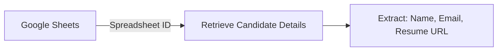
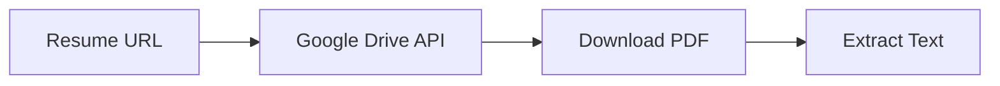
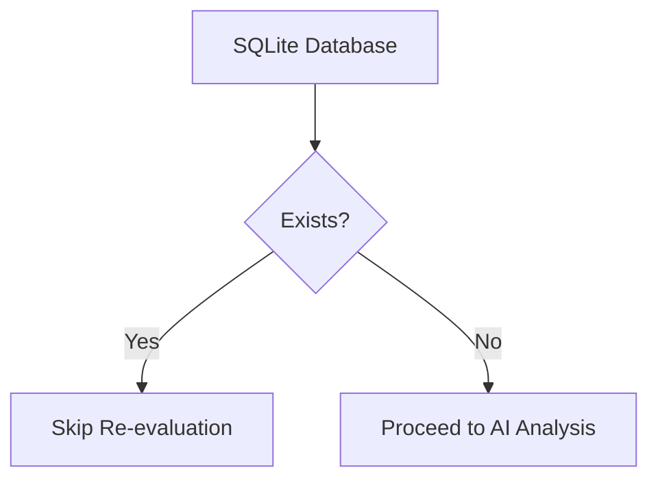
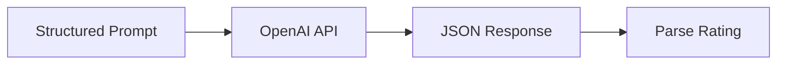
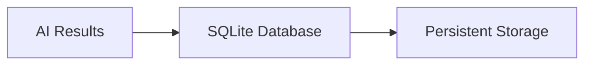
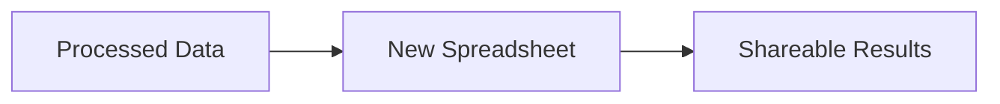
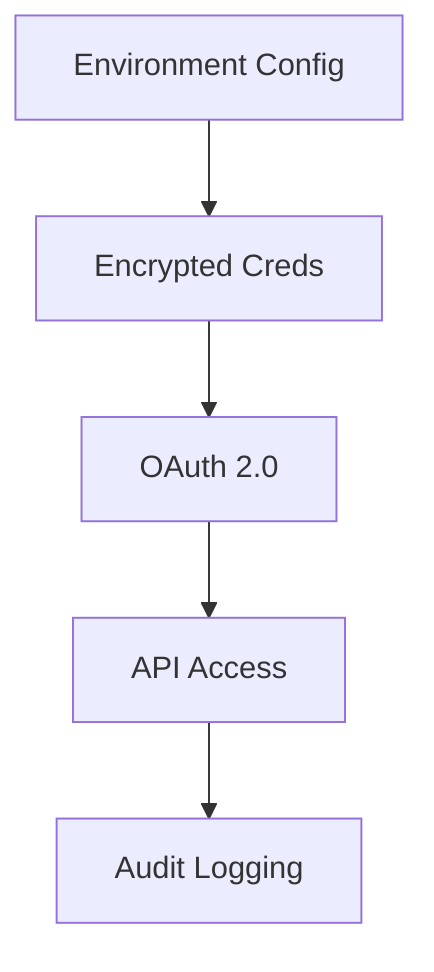

```markdown
# 🧠⚡ Freddie Recruit AI Rating System

<div align="center">
  
  
  *"Precision candidate evaluation powered by AI and Google Workspace"*
  
  [](LICENSE)
  [](https://freddierecruit.runasp.net/api/rankings)
  [](https://freddierecruit.runasp.net/swagger/index.html)
</div>

## 🌟 Objective?

Transforms recruitment by combining AI analysis with seamless Google Workspace integration to deliver:

```diff
+✅ Faster candidate screening
+🎯 Data-driven hiring decisions
+📈 Consistent evaluation metrics
```

---

## 🛠️ Core Technology Stack

| Component              | Technology               | Purpose                          |
|------------------------|--------------------------|----------------------------------|
| **Backbone**           | .NET Core 8.0            | High-performance processing      |
| **Data Storage**       | SQLite                   | Local candidate database         |
| **Cloud Integration**  | Google Sheets/Drive API  | Resume & candidate data pipeline |
| **AI Engine**          | OpenAI GPT-4             | Intelligent candidate analysis   |
| **Delivery**           | REST API                 | Seamless integration             |

---

## 🔄 Detailed Workflow Process

### 1. 📥 Fetch Applicant Data


- Connects to Google Sheets using the provided Spreadsheet ID
- Retrieves all applicant details including resume URLs

### 2. 📄 Process Resume Content


- Accesses each candidate's resume via Google Drive
- Downloads and extracts text content from PDFs
- Formats resume content for AI processing

### 3. 🔍 Check Existing Evaluations


- Verifies if candidate already exists in local SQLite database
- Prevents duplicate processing of previously evaluated candidates

### 4. 🤖 AI-Powered Evaluation


**Sample Prompt Structure:**
```text
Analyze this candidate for [Position]:
- Name: [Candidate Name]
- Strengths: [Key Strengths]
- Weakness: [Biggest Weakness]
- Available: [Yes/No]
Resume Highlights: [Formatted Content]

Evaluation Criteria:
1. Relevant Experience (0-40)
2. Skills Match (0-30)
3. Cultural Fit (0-30)

Response Format: {"rate":0-100,"details":"analysis"}
```

### 5. 💾 Store Evaluation Results


- Saves complete evaluation to `Freddie.db`
- Includes rating, analysis notes, and evaluation timestamp

### 6. 📊 Update Google Sheets


- Generates new Google Spreadsheet with all evaluations
- Returns spreadsheet URL in API response

---

## 🚀 Live System Access

<div align="center">
  <a href="https://freddierecruit.runasp.net/api/rankings">
    
  </a>
  
  <a href="https://freddierecruit.runasp.net/swagger/index.html">
    
  </a>
</div>

---

## 🧩 System Components

| Service File               | Purpose                                                                 | Key Methods                     |
|----------------------------|-------------------------------------------------------------------------|---------------------------------|
| `GoogleSheetsService.cs`   | Handles all Google Sheets interactions                                  | `GetCandidatesAsync()`          |
| `ResumeProcessor.cs`       | Manages resume downloads and text extraction                           | `ExtractResumeTextAsync()`      |
| `OpenAiEvaluationService.cs` | Orchestrates AI analysis and rating generation                        | `EvaluateCandidateAsync()`      |
| `RecruitmentProcessor.cs`  | Main workflow coordinator                                              | `RunEvaluationPipelineAsync()`  |
| `GoogleAuthService.cs`     | Centralized Google API authentication                                  | `GetCredentials()`              |

---

## 📋 Sample Outputs

### AI Response Example
```json
{
  "rate": 85,
  "details": "Candidate demonstrates strong experience in digital marketing with excellent technical skills..."
}
```

### API Final Response
```json
{
  "status": "Success",
  "spreadsheet": "https://docs.google.com/spreadsheets/d/ABC123",
  "evaluations": [
    {
      "candidate": "Samantha Greene",
      "score": 85,
      "analysis": "6 years relevant experience...",
      "date": "2025-03-29T14:30:00Z"
    }
  ]
}
```

---

## 🛡️ Security Architecture



- **Multi-layer protection** for API keys and credentials
- **Strict scope limitations** on Google API permissions
- **Automated token refresh** for continuous security

---

## 🚀 Getting Started

### Prerequisites
- .NET 8.0 SDK
- Google Cloud Project
- OpenAI API access

### Installation
```bash
# Clone repository
git clone https://github.com/Meekdavid/Freddie_Assesment.git

# Navigate to project
cd Freddie_Assesment

# Install dependencies
dotnet restore
```

### Configuration
1. Create `appsettings.Development.json` from template
2. Add your credentials:
   ```json
   {
     "GoogleApi": {
       "ServiceAccountKeyPath": "credentials.json",
       "SpreadsheetId": "your-sheet-id"
     },
     "OpenAI": {
       "ApiKey": "your-api-key"
     }
   }
   ```

---

<div align="center">
  <h3>💡 Intelligent Hiring Starts Here</h3>
  <p>
    <a href="#-freddie-recruit-ai-rating-system">Back to Top</a> •
    <a href="CONTRIBUTING.md">Contribute</a> •
    <a href="LICENSE">License</a>
  </p>
</div>
```
